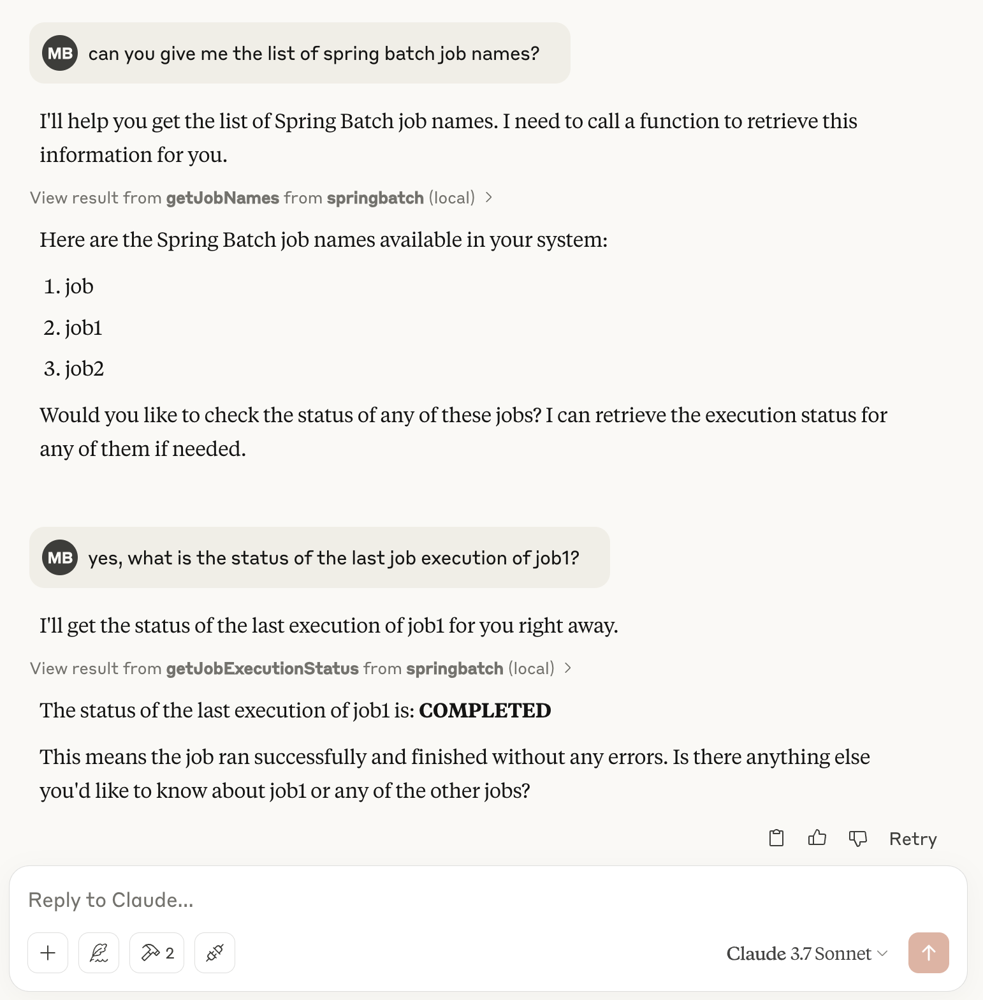

## About this repository

This repository contains a PoC of an MCP server for Spring Batch. It is a Spring AI based Spring Boot application that exposes a few MCP Tools for LLMs to manage Spring Batch jobs.

The PoC currently works with a PostgreSQL database, but can be easily adapted to work with other databases.

Make sure to have a PostgreSQL database running and populated with some Spring Batch meta-data before starting the application.

The server uses the typical Spring Boot properties to configure the database connection: `spring.datasource.[url|user|password]`.

## Build the MCP server

```bash
$>./mvnw clean package
```

## Add the server to Claude Desktop's configuration file

```json
{
  "mcpServers": {
    "springbatch": {
      "command": "java",
      "args": ["-jar", "/ABSOLUTE/PATH/TO/spring-batch-mcp-server-1.0-SNAPSHOT.jar"]
    }
  }
}
```

You might need to point to the full path of the `java` command, something like: `/Users/mbh/.sdkman/candidates/java/current/bin/java`

## Examples

